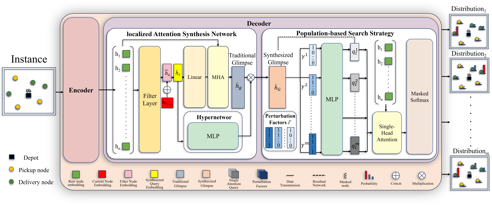

# LPPO
LPPO is a learning based construction framework for solving the pickup and delivery problems, a.k.a. PDPs (e.g., PDTSP and m-PDTSP).
Its primary contributions can be summarized as follows:
- We propose a novel lightweight population-based policy optimization (LPPO) to promote the search diversity of neural construction solvers for PDP variants. By leveraging designed perturbation factors, LPPO learns a population of diverse search strategies through a single decoder, without significantly increasing computation time;
- We design a LAS network that prioritizes effective decision-relevant information regarding the current node within the contextual representation, facilitating more precise node selection. It incorporates a hypernetwork to adaptively highlight salient features and refine the solution construction process;
- We develop a cluster search scheme during inference that can efficiently identify the most effective perturbation factors, enabling the selection of promising search strategies from the population for a specific problem instance, which enhances the search efficiency and solution quality. Extensive experimental results on both PDTSP and m-PDTSP verify the superiority of our LPPO to the state-of-the-art neural models that are specialized for PDP variants.


# Paper


Code implementation for the paper "Lightweight Population-Based Policy Optimization for Pickup and Delivery Problems".


# Hints for First-Time Users


# Dependencies
* Python>=3.8.20
* PyTorch>=2.0.0+cu118
* numpy
* tensorboard_logger
* tqdm
* pandas 
* pytz
* scipy

# Usage
## Generating data
The training data of m-PDTSP problem is generated by "M-PDTSP/Lppo/gener_data.py". We also provided some randomly generated data in the folder "M-PDTSP/Lppo/mdatasets".

## Training
### PDTSP examples
All parameter configurations are set in "train_nx.py" The model parameters are located in "model_params", the optimization parameters are located in "optimizer_params" and the training parameters are located in "trainer_params".

20 nodes:
```python
python train_n20.py
```

50 nodes:
```python
python train_n50.py
```

100 nodes:
```python
python train_n100.py
```

## Inference
All parameter configurations are set in "eval_n100.py", with model parameters in "model_params", optimization parameters in "optimizer_params" and test parameters in "tester_params".

Test directly without clustering.
```python
python eval_n100.py
```
Test with clustering
```python
python eval_Vector_select.py
```

### The m-PDTSP example is similar to PDTSP.
